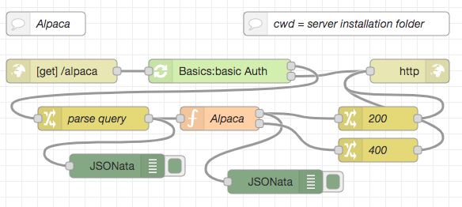
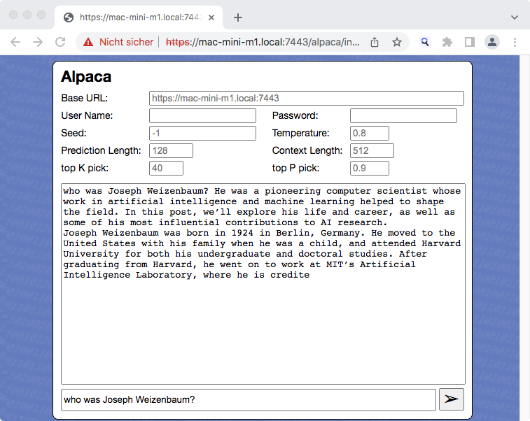

# node-red-flow-alpaca #

Node-RED Flow (and web page example) for the Alpaca AI model, trained with GPT-3

> Nota bene: if you are interested in serving LLMs from a Node-RED server, you may also be interested in [node-red-flow-openai-api](https://github.com/rozek/node-red-flow-openai-api), a set of flows which implement a relevant subset of OpenAI APIs and may act as a drop-in replacement for OpenAI in [LangChain](https://github.com/hwchase17/langchainjs) or similar tools and may directly be used from within [Flowise](https://github.com/rozek/Flowise), the no-code environment for LangChain

This repository contains a function node for [Node-RED](https://nodered.org/) which can be used to run the [Stanford Alpaca model](https://github.com/tatsu-lab/stanford_alpaca) (a fine-tuned variant of the [LLaMA model](https://ai.facebook.com/blog/large-language-model-llama-meta-ai/)) using [llama.cpp](https://github.com/rozek/llama.cpp) within a Node-RED flow. **Inference is done on the CPU** (without requiring any special hardware) and still completes within a few seconds on a reasonably powerful computer.

Additionally, this repo also contains function nodes to tokenize a prompt or to calculate embeddings based on the Alpaca model.

Having the inference, tokenization and embedding calculation as a self-contained function node gives you the possibility to create your own user interface or even use it as part of an autonomous agent.

> Nota bene: these flows do not contain the actual model. You will have to download your own copy from [HuggingFace](https://huggingface.co/Sosaka/Alpaca-native-4bit-ggml/blob/main/ggml-alpaca-7b-q4.bin).

If you like, you may also check out similar nodes and flows for other AI models as there are

* [Meta AI LLaMA](https://github.com/rozek/node-red-flow-llama)
* [Stanford Alpaca, trained with GPT-4](https://github.com/rozek/node-red-flow-gpt4-x-alpaca)
* [Nomic AI GPT4All (filtered version)](https://github.com/rozek/node-red-flow-gpt4all-filtered)
* [Nomic AI GPT4All (unfiltered version)](https://github.com/rozek/node-red-flow-gpt4all-unfiltered)
* [Nomic AI GPT4All-J](https://github.com/rozek/node-red-flow-gpt4all-j)
* [Vicuna](https://github.com/rozek/node-red-flow-vicuna)
* [OpenLLaMA](https://github.com/rozek/node-red-flow-openllama)
* [WizardLM](https://github.com/rozek/node-red-flow-wizardlm)

> Just a small note: if you like this work and plan to use it, consider "starring" this repository (you will find the "Star" button on the top right of this page), so that I know which of my repositories to take most care of.

## Installation ##

Start by creating a subfolder called `ai` within the installation folder of your Node-RED server. This subfolder will later store both the executable and the actual model. Using such a subfolder helps keeping the folder structure of your server clean if you decide to play with other AI models as well.

### Building the Executable ###

The actual "heavy lifting" is done by [llama.cpp](https://github.com/rozek/llama.cpp). Simply follow the instructions found in section [Usage](https://github.com/rozek/llama.cpp#usage) of the llama.cpp docs to build the `main` executable for your platform.

Afterwards, rename 

* `main` to `llama`,
* `tokenization` to `llama-tokenization` and
* `embedding` to `llama-embeddings`

and copy them into the subfolder `ai` you created before.

### Preparing the Model ###

Just download the model from [HuggingFace](https://huggingface.co/Sosaka/Alpaca-native-4bit-ggml/blob/main/ggml-alpaca-7b-q4.bin) - it already has the proper format.

> Nota bene: right now, the function node supports the 7B model only - but this may easily be changed in the function source

Afterwards, move the file `ggml-alpaca-7b-q4.bin` into the same subfolder `ai` where you already placed the `llama` executable.

### Importing the Nodes ###

Finally, open the Flow Editor of your Node-RED server and import the contents of [Alpaca-Function.json](./Alpaca-Function.json). After deploying your changes, you are ready to run Alpaca inferences directly from within Node-RED.

Additionally, you may also import the contents of [Alpaca-Tokenization.json](./Alpaca-Tokenization.json) if you want to tokenize prompts, or of [Alpaca-Embeddings.json](./Alpaca-Embeddings.json) if you want to calculate embeddings for a given text.

## Usage ##

All function nodes expect their parameters as properties of the msg object. The prompt itself (or the input text to tokenize or calculate embeddings from) is expected in `msg.payload` and will later be replaced by the function result.

All properties (except prompt or input text) are optional. If given, they should be strings (even if they contain numbers), this makes it simpler to extract them from an HTTP request.

### Inference Node ###

Inference supports the following properties:

* `payload` - this is the actual prompt 
* `seed` - seed value for the internal pseudo random number generator (integer, default: -1, use random seed for <= 0)
* `threads` - number of threads to use during computation (integer ≧ 1, default: 4)
* `context` - size of the prompt context (0...2048, default: 512)
* `keep` - number of tokens to keep from the initial prompt (integer ≧ -1, default: 0, -1 = all)
* `predict` - number of tokens to predict (integer ≧ -1, default: 128, -1 = infinity)
* `topk` - top-k sampling limit (integer ≧ 1, default: 40)
* `topp` - top-p sampling limit (0.0...1.0, default: 0.9)
* `temperature` - temperature (0.0...2.0, default: 0.8)
* `batches` - batch size for prompt processing (integer ≧ 1, default: 8)

### Tokenization Node ###

Tokenization supports the following properties:

* `payload` - this is the actual input text 
* `threads` - number of threads to use during computation (integer ≧ 1, default: 4)
* `context` - size of the prompt context (0...2048, default: 512)

### Embeddings Node ###

Embeddings calculation supports the following properties:

* `payload` - this is the actual input text  
* `seed` - seed value for the internal pseudo random number generator (integer, default: -1, use random seed for <= 0)
* `threads` - number of threads to use during computation (integer ≧ 1, default: 4)
* `context` - size of the prompt context (0...2048, default: 512)

## Inference Example ##

The file [Alpaca-HTTP-Endpoint.json](./Alpaca-HTTP-Endpoint.json) contains an example which uses the Alpaca function node to answer HTTP requests. The prompt itself and any inference parameters have to be passed as query parameters, the result of the inference will then be returned in the body of the HTTP response.

> Nota bene: the screenshot from above shows a modified version of this flow including an authentication node from the author's [Node-RED Authorization Examples](https://github.com/rozek/node-red-authorization-examples), the flow in [Alpaca-HTTP-Endpoint.json](./Alpaca-HTTP-Endpoint.json) comes without any authentication.

The following parameters are supported (most of them will be copied into a `msg` property of the same name):

* `prompt` - will be copied into `msg.payload`
* `seed` - will be copied into `msg.seed`
* `threads` - will be copied into `msg.threads`
* `context` - will be copied into `msg.context`
* `keep` - will be copied into `msg.keep`
* `predict` - will be copied into `msg.predict`
* `topk` - will be copied into `msg.topk`
* `topp` - will be copied into `msg.topp`
* `temperature` - will be copied into `msg.temperature`
* `batches` - will be copied into `msg.batches`

In order to install this flow, simply open the Flow Editor of your Node-RED server and import the contents of [Alpaca-HTTP-Endpoint.json](./Alpaca-HTTP-Endpoint.json)

### Web Page ###

The file [Alpaca.html](./Alpaca.html) contains a trivial web page which can act as a user interface for the HTTP endpoint.

Ideally, this page should be served from the same Node-RED server that also accepts the HTTP requests for Alpaca, but this is not strictly necessary.

The input fields `Base URL`, `User Name` and `Password` can be used if web server and Node-RED server are at different locations: just enter the base URL of your Node-RED HTTP endpoint (without the trailing `alpaca`) and, if that server requires basic authentication, your user name and your password in the related input fields before you send your first prompt - otherwise, just leave all these fields empty.

The input fields `Seed`, `Temperature`, `Prediction Length`, `Context Length`, `top K pick` and `top P pick` may be used to customize some of the parameters described above - if left empty, their "placeholders" show the respective default values.

The largest field will show a transcript of your current dialog with the inference node.

Finally, the bottommost input field may be used to enter a prompt - if one is present, the "Send" button becomes enabled: press it to submit your prompt, then wait for a response.

> Nota bene: **inference is still done on the Node-RED server**, not within your browser!

## License ##

[MIT License](LICENSE.md)
